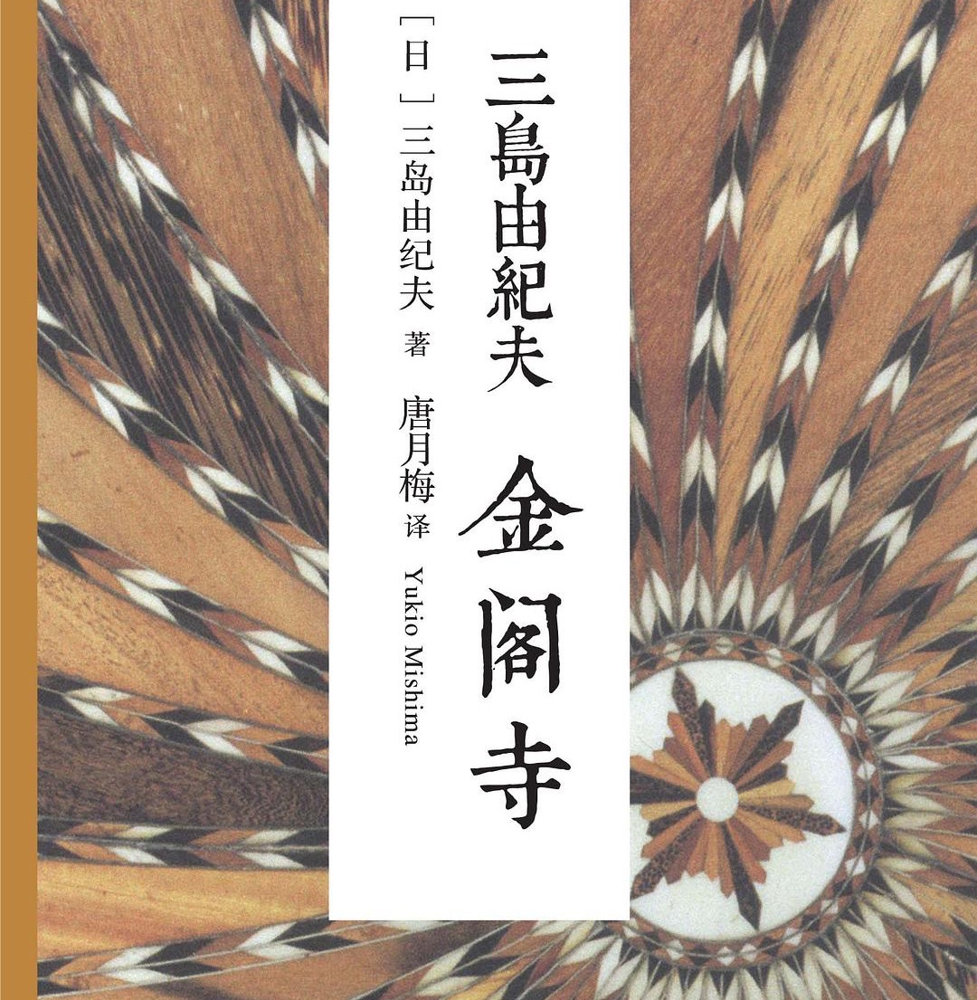
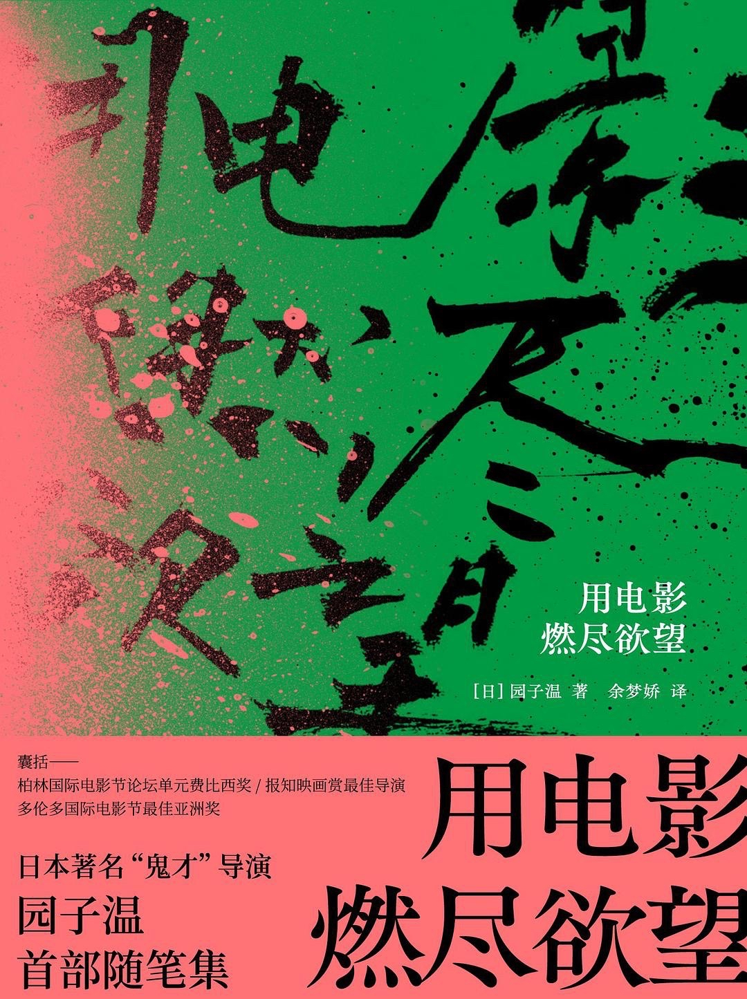
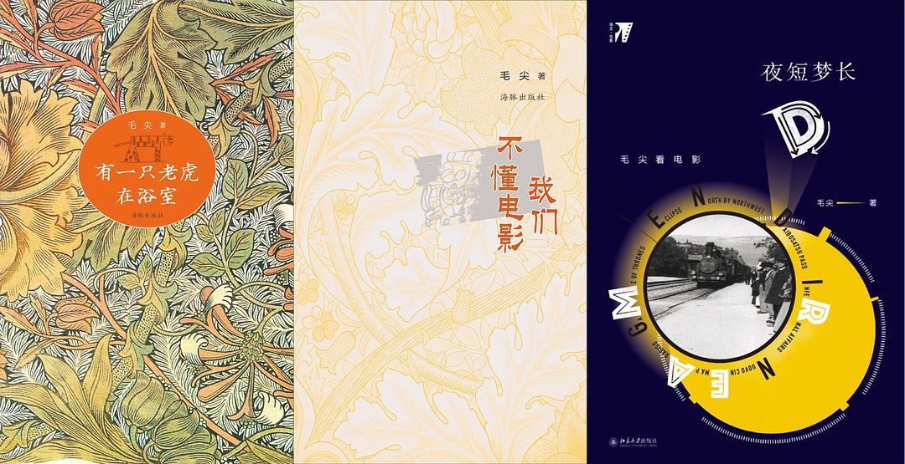

# Booklist

今年读过所有书里面最喜欢的就是三岛由纪夫的《金阁寺》，文字美到想全文背诵。 这本书我认为主角是金阁本身，它就是世间至美的化身，美既是细部，也是整体；既是金阁，也是笼罩金阁之夜。

“有时候我觉得鹤川是个精通炼金术的师傅，仿佛可以将铅炼成金。我是底片，他是正片。我的混浊的阴暗感情，旦经过他的心的过滤，就一无遗漏地变成透明的、放射光芒的感情,我不知多少次惊讶的凝望着这种变化。我结结巴巴，踌躇不前，这时鹤川的手把我的感情翻过来，完全传向外侧。 ” 
读这段时整个人冒粉红泡泡，也太会写了吧！ 

------

今年第二本我喜欢的书是园子温的《用电影燃尽欲望》，与其他严肃的自传不同，我很喜欢园子温这种幽默的讲述方式。

“为了给电影镀金，我在传单上方重叠印了一句“泊林国际电影节参展作品”，文字和照片混在一起，仔细看才会发现不是“柏”而是“泊”。所谓“泊林国际电影节”是在我自己家举行的电影节，我也没撒谎呀。”这种宣传方法笑死我了，宣发鬼才园子温。

书里有一章专门讲日本电影衰败的原因：我不觉得日本人很正经。在一般的租碟店设置巨大的成人影片区是日本固有的文化。日本的青年漫画杂志中也是裸体和性爱泛滥。尽管如此,电视哪怕到了深夜也不怎么出现裸体和性爱，电影更是这样。因为像水油分离一样将“文化”与“欲望”完全隔开，所以整个生态已经扭曲。结果,到处都是描写高中生的清淡爱情、职场的浪漫故事面包店和点心店温暖日常的电影。这种电影中根本没有诚实的欲望。因为追求过剩的道义,文化才会变得纤细羸弱。心有戚戚焉。

园子温一直在书里探讨电影性。“电影就是电影”这种试图将电影独立出来的想法是不行的。

------

中国电影方面我读了毛尖的《有一只老虎在浴室》、《夜短梦长》和《我们不懂电影》。在这之前我完全不了解毛尖这个作家，看完三本后觉得她是个伶牙俐齿的人，有上海人的辛辣。 

二十年来的中国电影,只要拍到枭雄奸雄黑道大腕黑帮大佬,无一例外给他们添加文艺腔,让他们深情到变态,苦逼到自虐,这个,就是我们的最高想象力。
说到底,《失恋33天》的成功,不是电影的胜利,那是电视剧的胜利,是中景接中景的胜利。Baby baby,大家都不要装B,今天的中国电影,如果没有电视剧明星撑着场子还叫中国电影?还能做大买卖?权贵兮兮的电影圈,再不向电视剧学习,就算全景中景近景三位一体,也要死了。
反正,年末评点电影,我们这些以看电影为业的,感觉都很丢脸,原来以为做的是精神文明的事,到头来发现干的是精神分裂的活。从前,电影有劲的时候,朋友把正儿八经的职业给辞了专事影评。现在,他说拿了电影公司的票回来写影评,感觉自己跟贩毒卖淫一样。

